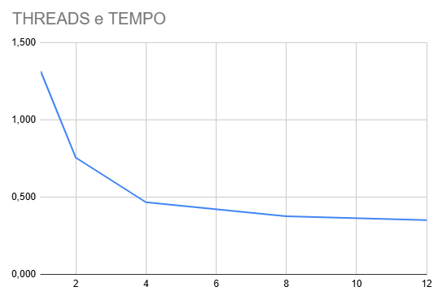
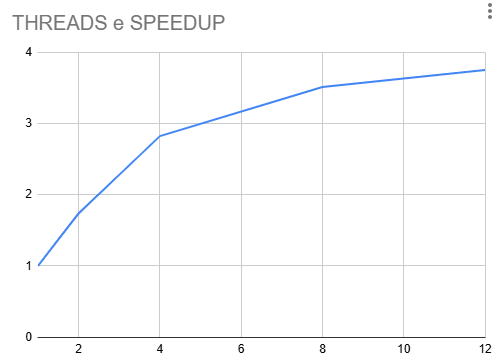
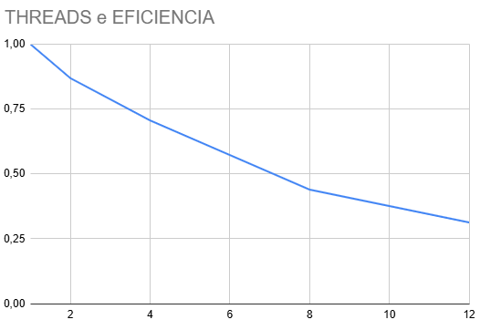

# Relatório da Atividade: Soma Paralela de Números

**Disciplina:** PROGRAMAÇÃO CONCORRENTE E DISTRIBUÍDA  
**Aluno(s):** Vinícius Caetano de Assis  
**Turma:** 24 | GPADSM  
**Professor:** RAFAEL MARCONI RAMOS  
**Data:** 13/03/2026

---

## 1. Descrição do Problema
O objetivo foi implementar uma solução eficiente para somar um grande volume de números contidos em um arquivo texto, comparando a execução serial com a execução paralela utilizando múltiplos processos (`multiprocessing`), variando entre 1, 2, 4, 8 e 12 threads/processos.

* **Algoritmo utilizado:** Utilizou-se o módulo `multiprocessing` com `Pool.starmap` para distribuir blocos do arquivo de forma balanceada. Cada processo lê seu próprio segmento do arquivo em modo binário (`'rb'`), garantindo a integridade dos dados através de `seek` e `readline` para evitar cortes de números no meio de linhas.
* **Volume de dados:** 10 milhões de números (`numero2.txt`).
* **Complexidade:** A complexidade teórica é $O(n)$, onde $n$ é o número de elementos, sendo linear em relação ao tamanho do arquivo.

## 2. Ambiente Experimental

| Item | Descrição |
| :--- | :--- |
| **Processador** | i7 |
| **Número de núcleos** | 32 (lógicos) |
| **Memória RAM** | 16GB |
| **Sistema Operacional** | Windows 11 |
| **Linguagem utilizada** | Python |
| **Biblioteca de paralelização** | multiprocessing |
| **Compilador / Versão** | VS Code |

## 3. Metodologia de Testes
* **Medição:** Utilizou-se `time.perf_counter()` para alta precisão.
* **Execuções:** Foram realizadas 2 execuções para cada configuração, utilizando a média aritmética para compor a tabela final.
* **Condições:** Testes realizados em ambiente de desenvolvimento (VS Code) com processos de fundo do sistema operacional.

## 4. Resultados Experimentais

| Nº Threads/Processos | Tempo de Execução (s) médio |
| :--- | :--- |
| 1 | 1,315 |
| 2 | 0,755 |
| 4 | 0,465 |
| 8 | 0,375 |
| 12 | 0,350 |

## 5. Cálculo de Speedup e Eficiência

| Threads | Tempo (s) | Speedup | Eficiência |
| :--- | :--- | :--- | :--- |
| 1 | 1,315 | 1.000 | 1.000 |
| 2 | 0,755 | 1,741 | 0,870 |
| 4 | 0,465 | 2,827 | 0,707 |
| 8 | 0,375 | 3,506 | 0,438 |
| 12 | 0,350 | 3,757 | 0,313 |

## 6. Gráficos

## 7. Análise dos Resultados
* **Escalabilidade:** A aplicação apresentou uma escalabilidade sublinear. O speedup aumenta com o número de threads, porém a taxa de ganho diminui progressivamente.
* **Eficiência:** A eficiência caiu significativamente à medida que aumentamos as threads devido ao custo de *overhead* (criação de processos e gerenciamento).
* **Gargalos:** O principal gargalo observado é a I/O (leitura do arquivo no disco). O acesso concorrente ao mesmo arquivo gera contenção.
* **Hardware:** O número de threads testadas está dentro do limite da máquina, indicando que a limitação é imposta pela saturação do barramento de I/O e não por falta de núcleos.

## 8. Conclusão
O paralelismo trouxe ganhos significativos de desempenho, reduzindo o tempo total de 1,315s para 0,350s. A escalabilidade é limitada pela Lei de Amdahl, onde o tempo de leitura do arquivo (serial) torna-se o limitador. O melhor número de threads para este cenário foi 12, com ganhos marginais após 8 threads. Melhorias futuras incluem o uso de *memory mapping* (`mmap`) para acelerar a leitura dos dados.
